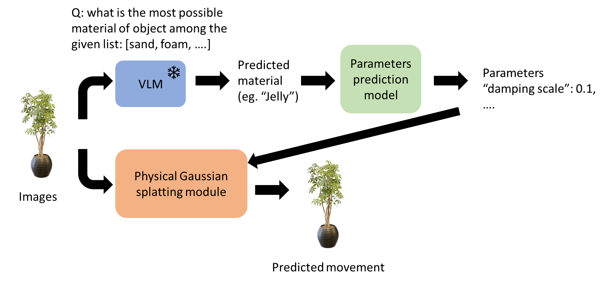
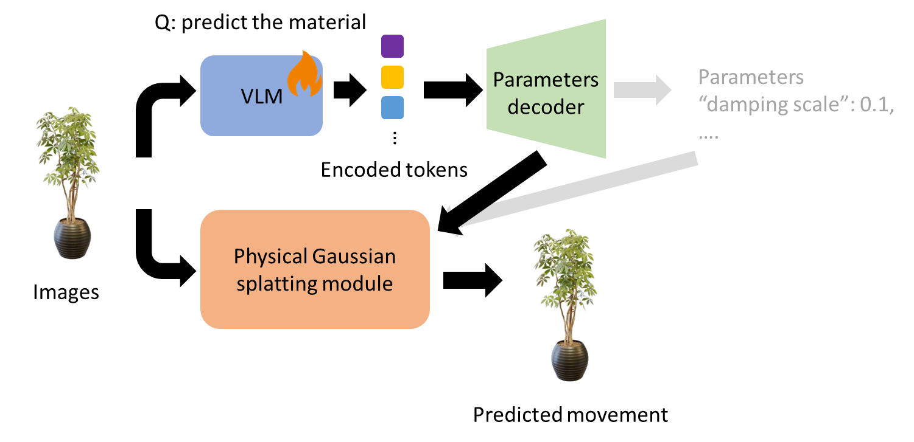

[](https://classroom.github.com/a/SdXSjEmH)
# EV-HW3: PhysGaussian

This homework is based on the recent CVPR 2024 paper [PhysGaussian](https://github.com/XPandora/PhysGaussian/tree/main), which introduces a novel framework that integrates physical constraints into 3D Gaussian representations for modeling generative dynamics.
<!-- 
You are **not required** to implement training from scratch. Instead, your task is to set up the environment as specified in the official repository and run the simulation scripts to observe and analyze the results.
 -->

## Environment Setup
```bash
git clone --recurse-submodules git@github.com:XPandora/PhysGaussian.git

cd PhysGaussian
conda create -n PhysGaussian python=3.9
conda activate PhysGaussian

pip install -r requirements.txt
pip install -e gaussian-splatting/submodules/diff-gaussian-rasterization/
pip install -e gaussian-splatting/submodules/simple-knn/
apt install ffmpeg # If not downloaded

# Download the checkpoints provided from the original repo
pip install gdown
bash download_sample_model.sh
```

<!-- ## Running the Simulation -->
<!-- Follow the "Quick Start" section and execute the simulation scripts as instructed. Make sure to verify your outputs and understand the role of physics constraints in the generated dynamics. -->
## Usage

### Simulation
The results can be created via the main `gs_simulation.py` script. 

```bash
cd PhysGaussian 
CUDA_VISIBLE_DEVICES=0 python gs_simulation.py \
    --model_path <path/to/your/model> \
    --output_path <output/dir> \
    --config ./config/<your/config>.json \
    --render_img --compile_video --white_bg \
    --material <material>
```
- `--material`: Supported materials include `jelly`, `metal`, `sand`, `foam`, `snow` and `plasticine`

For example:
```bash
cd PhysGaussian
CUDA_VISIBLE_DEVICES=0 python gs_simulation.py \
    --model_path ./model/ficus_whitebg-trained/ \
    --output_path ficus_jelly \
    --config ./config/ficus_config.json \
    --render_img --compile_video --white_bg \
    --material jelly
```
### Evaluation
PSNR evaluation can be done by `psnr.py`. For script usage:
```bash
python psnr.py --predicted_dir </path/to/predicted/dir> --gt_output_dir </path/to/gt/dir>
```

<!-- ## Homework Instructions
Please complete Part 1–2 as described in the [Google Slides](https://docs.google.com/presentation/d/13JcQC12pI8Wb9ZuaVV400HVZr9eUeZvf7gB7Le8FRV4/edit?usp=sharing). -->

### Reproducing experimental results
The experiment results are done by the script `run_ablation_study.py`.
```bash
cd PhysGaussian
python run_ablation_study.py
```

## Results: Part 1

Results of all supported materials are rendered. For the videos, see https://youtu.be/ytVYn0cDvRc.


## Results: Part 2
For each listed required condition, here we adjust them by factors of 0.5 and 2 to see whether their effects are enhanced, weakened or not changed at all with the modifications.

Here we calculate the average PSNR of all the rendered image pairs of results between experimented and original conditions (n=125).

* `substep_dt` = 1.5e-4 failed for material jelly, probably due to out-of-bounding-box pixels. Therefore, the results are removed.

### Jelly
Link: https://youtu.be/ugW75BK1bqo
| n_grid | substep_dt | grid_v_damping_scale | softening_values | PSNR |
|--|--|--|--|--|
| 50 | 1e-4 | 0.9999 | 0.1 | - |
|  25 | - | - | - | 76.2453 |
| 100 | - | - | - | 76.2126 |
| - | 5e-5 | - | - | 22.0810 |
| - | - | 0.9995 | - | 22.0811 |
| - | - | 1.0005 | - | 19.9981 |
| - | - | - | 0.05 | 76.3050 |
| - | - | - | 0.2 | 76.3466 |


### Sand
Link: https://youtu.be/FZnDeudkTOg
| n_grid | substep_dt | grid_v_damping_scale | softening_values | PSNR |
|--|--|--|--|--|
| 50 | 1e-4 | 0.9999 | 0.1 | - |
|  25 | - | - | - | 44.3984 |
| 100 | - | - | - | 45.6289 |
| - | 5e-5 | - | - | 14.8343 |
| - | - | 0.9995 | - | 14.9587 |
| - | - | 1.0005 | - | 15.6896 |
| - | - | - | 0.05 | 45.5952 |
| - | - | - | 0.2 | 44.5533 |

## Observation

### Materials
The results for `jelly` and `plasticine` are quite similar, with the plant swaying and bouncing back and forth. In contrast, for `snow`, `metal`, and `foam`, the plant leans to one side and does not bounce back. The behavior of `sand` stands out as unique, with the plant leaning to one side while simultaneously spreading its branches and leaves, mimicking the flow of sand.

### Conditions
Adjusting the `n_grid` and `softening` parameters by factors of 0.5 and 2 did not result in noticeable changes for either of the tested materials (`jelly` and `sand`). 

However, modifying the `grid_v_damping_scale` parameter had a significant impact. When decreased, the swaying motion was quickly dampened, while increasing it caused the swaying to persist indefinitely, often with larger amplitudes. This behavior aligns with its physical interpretation: values less than 1 induce damping, while values greater than 1 lead to acceleration. Similarly, changes to the `substep_dt` parameter produced comparable effects, following the same trend.


<!-- 
#### Materials
Results of `jelly` and `plasticine` are very similar - the plant swaying and bouncing back and forth. For `snow`, `metal` and `foam`, the plant leans to one side and never bounces up again. Finally, `Sand` is a unique material, with the plant leaning to one side and at the same time spreading the branches and leafs just like sand.

#### Conditions
Changing `n_grid` and `softening` parameters by 0.5 and 2 times did not lead to significant changes for both experimented materials (`jelly` and `sand`).

Changing `grid_v_damping_scale`, on the other hand, created significant effects. When decreased, the swaying velocity is damped very fast, and while increased it keeps swaying and never stops, even with larger amplitude. This is aligned with its physical meaning - scale < 1 for damping, and > 1 for acceleration. Changing `substep_dt` has similar results with the same trned. -->


## Bonus
Learning the configurations via training a model on real-world videos can be applicable. 

First, we establish a dataset of real-world observation videos can be established. The videos should contain different objects of the same materials; for example, for cloth, we can record a map falling to the floor or a T-shirt dropped onto the bed.

Secondly, the dataset will be used to train a model to produce the desired configuration parameters. The objective of training will be minimizing the difference between ground truth and the simulated videos of object movement.

The above are to generate configuration of fixed, pre-defined materials. For automatic inference, we can the material of an object with nowadays VLM within a pre-defined set, and then send the prediction to the `PhysGaussian` module.


Moreover, the generalize the workflow, we can fine-tune the VLM model to return a set of encoded information of parameters/configuration with no pre-defined materials, and then decode with a decoder.


Either way can be helpful to the generalization and automatic inference on the materials of the objects provided.

## Reference
```bibtex
@inproceedings{xie2024physgaussian,
    title     = {Physgaussian: Physics-integrated 3d gaussians for generative dynamics},
    author    = {Xie, Tianyi and Zong, Zeshun and Qiu, Yuxing and Li, Xuan and Feng, Yutao and Yang, Yin and Jiang, Chenfanfu},
    booktitle = {Proceedings of the IEEE/CVF Conference on Computer Vision and Pattern Recognition},
    year      = {2024}
}
```

## Appendix

### Troubleshooting

If you encounter issues during setup or execution, consider the following tips:

- **CUDA Errors:**  
    If you see errors related to CUDA header running on a WSL2 environment, try this:
    ```bash
    export LD_LIBRARY_PATH=/usr/lib/wsl/lib:$LD_LIBRARY_PATH
    ```
    You can refer to [this issue](https://github.com/taichi-dev/taichi/issues/8300) for more information.

- **Encoding Issues:**  
    If you get errors like `ascii codec can't encode character`, set the environment variable to use UTF-8 encoding: ([ref](https://stackoverflow.com/questions/56104377/ascii-codec-cant-encode-character-ordinal-not-in-range-128))
    ```bash
    export PYTHONIOENCODING=utf8
    ```
- **assertion failure: prealloc_size <= total_mem**
    Navigate to `gs_simulation.py` and change line 43
    ```python
    ti.init(arch=ti.cuda, device_memory_GB=8.0)
    ```
    to the suitable size for your GPU.


### Environment setup on meow1/2 workstation 
(Thanks to classmate 陳仲肯 on Discord)
```bash
git clone --recurse-submodules git@github.com:XPandora/PhysGaussian.git

cd PhysGaussian
conda create -n PhysGaussian python=3.9
conda activate PhysGaussian

pip install torch==2.0.0 torchvision==0.15.1 --index-url https://download.pytorch.org/whl/cu118
pip install -r requirements.txt
conda install cuda-nvcc=11.8* cuda-libraries-dev=11.8* -c nvidia
conda install gxx=11.4.0 -c conda-forge

export CUDA_HOME=$CONDA_PREFIX
export CPATH=$CONDA_PREFIX/targets/x86_64-linux/include:$CPATH
export LD_LIBRARY_PATH=$CONDA_PREFIX/targets/x86_64-linux/lib:$LD_LIBRARY_PATH
export PATH=$CONDA_PREFIX/bin:$PATH

pip install -e gaussian-splatting/submodules/diff-gaussian-rasterization/ --verbose
pip install -e gaussian-splatting/submodules/simple-knn/ --verbose
```


